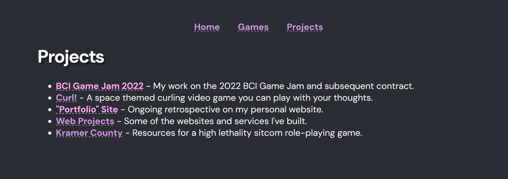
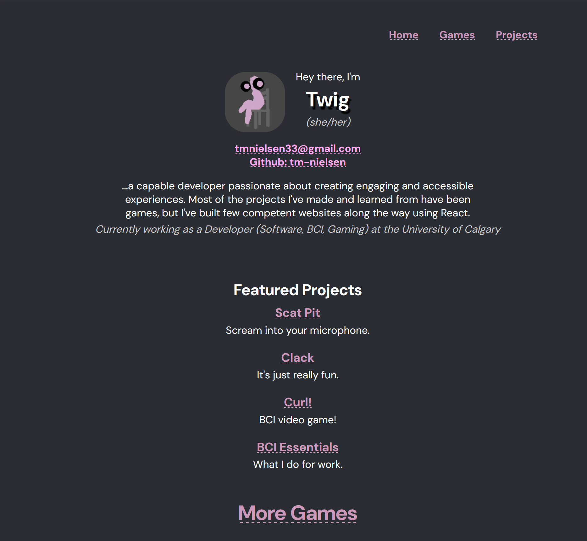

Hello and welcome!
(you're already here)

I started the first iteration of this site in the final year of my degree, wanting a place to show off my games. After some initial work, I shelved the project indefinitely to focus on whatever was in front of me at the time. Looking for work again in spring 2024 was a perfect excuse to revive the project. Having even more projects to write about and show off didn't hurt and was ultimately what got things moving.

The site exists for the Games page and, secondarily, the projects. The main page is obligatory but has been updated to be somewhat presentable. This order of priority is naturally reflected in the complexity of and effort put into each page. Like anything I make, I also wanted to learn something and have a little fun with it. To this end, I've used different iterations of the project to learn different technologies.

## The Latest Version: Jekyll
> [Custom markdown tokenization] was entirely unnecessary and probably made the site worse...

The more web development I do, the more of a luddite I become. There is simply a correct way for a website like this to be constructed. The React version of this website was essentially served in a single javascript file wrapped in an html index shell. This is very silly. With the exception of a few *(optional)* features, I've successfully migrated the entire content of the site to a normal, standard, useable, efficient and accessible format: just a bunch of html documents.

I learned about Jekyll on a work project. Though that specific site was somewhat bloated and blighted by modern web design by use of a theme, I could still see the enourmous potential to generate a clean, simple, easilly editable, and correctly formatted website. I already had all my content in markdown anyway.

Eventual complete migration started with a subproject for [Kramer County](/kramer), which I embedded as a jekyll site inside of the `public` folder of my React base. This was wonderful! Besides the horror of having them next to each other: a splinter I put in my own foot ensuring I would have to complete a full port at some point.

Thankfully, the port was rather painless and gave me a fantastic oppourunity to learn a whole lot more about jekyll and how I could use it to make a site with minimal frills.

### Comparisons
There were also a number of accessibility concerns *(issues of semantic correctness)* I wanted to address in this new version. Using specific tags instead of wrapping divs in style. A number of examples follow.

#### Games Page
One of my more siginificant gripes was the sort and filter dropdowns I originally made in react. They look pretty, but are made out of divs and buttons. It's silly. Addditionally, the entire page is dynamically constructed from a request to the itch.io api, which limits the projects I can include and makes the whole thing quite slow. I could simply update this site with a new downloaded version of that response whenever I make a new game, use that to 'bake' the site, then update it live with the request result.



Additionally, clicking on one of those game tiles use to expand it inside of the page. Another thing that looked cool, but wan't very useable. See all that text? You know what that should be? A seperate webpage.



Similarly, projects used to be loaded in from markdown on request using javascript, injected into the docuemnt when a *"link"* was clicked. Now I have an index page with **links** to other documents.



I also didn't love having my professional summary out there in front. I don't want someone's first impression of me to be resumt speak. This has since bween wrapped in a `details` dropdown, this is what the homepage used to look like:

## Previously: React
When originally putting together this site together, I used it an an excuse to learn typescript with React *(which I already knew)*. This ended up being really straightforward and also pretty cool.

### Custom Markdown Tokenizer
This page used to be formatted a bit strangely, but is now more useable.

I started writing it out in jsx, but realized quickly that the amount of text I wanted to include would make that format unreasonable. I pivoted towards markdown, as it is so wonderfully easy to write in. There are a wealth of tools available to convert the raw text directly into jsx. However, like most of my art (if you will grant me that this remotely counts), I was presented with a vision of what this page could be, then had to find a way to make it like that.

I wanted everything in collapsed sections, hoping that way you could read only what you want and not have the rest of it to scroll past. I don't think this was or is a great design decision for anyone, so I fixed it. But it presented an interesting design problem, as I would need to nest sections as children of their headers. Additionally, I only wanted a certain tier of header to capture "children" is a collapsed section.

I Looked through available packages. Naturally, There wasn't anything directly applicable to the task, but many things very close. A number of markdown tokenizers presented themselves as useful, but were too featured for my uses. It would be very possible to just not use all the data they provided, but they seemed a bit confusing. I could do this myself, right? I wrote my own simplified tokenizer, which ended up being a fair bit of work with the requisite helping of grief but generally straightforward overall, especially in typescript. Along with this I wrote a simple algorithm to nest a list of tokens into trees as I desired. This all gets turned into jsx in a similarly scaled down manner.

Ultimately, I could've applied the same nesting algorithm to an existing markdown package. The entire problem was entirely unnecessary and probably made the site worse, but that doesn't conflict with my goals for the project.

### Games Page
The games page is why this website exists. I poked around a bit when I was younger, but started properly making games in 2018, my first year of University. Since then I've made many, many games, most of which are available on [itch.io][0], a wonderful platform for sharing and selling games. It also has an API. The original conceit of this project was to make a nice display for that API response. I believe I've accomplished that.

In addition to the base information provided: title, release date, cover image, summary description, platforms, and a bit more, I wanted to include a bit of writing on each title with a longer description and what I learned from making it. This serves a dual purpose, effectively displaying the notable extent of technical and professional development I've gained from such projects, and a little personal scrapbook.

This was originally accomplished by supplementing the API with extra json data from a local file. A relatively simple task, but it stretched my limited understanding typescript to integrate an explicit data type with optional members, with a second data type known to me but unknown to the code, into a third explicitly defined data type. A wonderful learning opportunity.

Custom tags were also included in the extra json data, specifying my roles on a project, the tools I used, and general flavour. This all has to be integrated into a tile view, which was an engaging challenge to style responsively, or at all, but I'm quite content with how it turned out. The implementation of sorting and filtering also provided a classic problem to relearn in typescript. The end result may be slightly unorthodox, but I am very happy to have it implemented arbitrarily based only on tags in the extra json data.

This extra game data, including tags and other properties, have since been updated to be parsed from markdown. Writing and editing descriptions for a significant number of games as json text fields quickly proved to be impractical. As with this page, writing descriptions in markdown is much, much easier, more smooth, and allows a much greater degree of flexibility. To accomplish this, I had to expand my parsing system to grab named properties and property lists from a markdown header and to pad the heading level of generated jsx elements. I also stripped down the focused game tile description area to display arbitrary headers.

Static alternatives are also provided for games with animated cover images, to respect motion preferences. Apparently, you can check for that in a line or two with a media query, so that's pretty cool. The site has a very simple back end, which hides my API key and slightly cleans the base API response.

[0]: https://klungore.itch.io